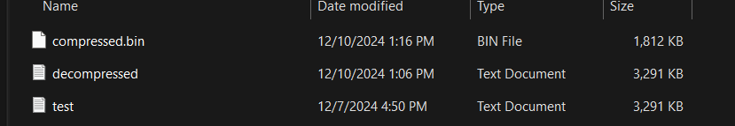

````markdown
# Huffman Coding File Compression Tool

## Table of Contents

- [Introduction](#introduction)
- [About Huffman Coding](#about-huffman-coding)
- [Features](#features)
- [Installation](#installation)
- [Usage](#usage)
  - [Compressing a File](#compressing-a-file)
  - [Decompressing a File](#decompressing-a-file)
- [References](#references)
- [Contributing](#contributing)
- [License](#license)

## Introduction

Welcome to the **Huffman Coding File Compression Tool**! This Python-based application leverages the Huffman Coding algorithm to efficiently compress and decompress text files. By reducing file sizes, it facilitates faster storage and transmission while preserving the original data integrity.

## About Huffman Coding

Huffman Coding is a widely-used algorithm for lossless data compression. It works by assigning variable-length codes to input characters, with shorter codes assigned to more frequent characters. This approach minimizes the total number of bits required to represent the data, resulting in effective compression.

### How It Works

1. **Frequency Analysis**: Calculate the frequency of each character in the input data.
2. **Building the Huffman Tree**: Create a binary tree where each leaf node represents a character, and the path from the root to the leaf determines the character's code.
3. **Generating Codes**: Assign binary codes to each character based on their position in the Huffman Tree.
4. **Encoding**: Replace each character in the input data with its corresponding Huffman code.
5. **Decoding**: Reconstruct the original data by traversing the Huffman Tree using the encoded binary data.

### Advantages

- **Efficiency**: Often achieves higher compression ratios compared to fixed-length encoding schemes.
- **Simplicity**: Relatively straightforward to implement and understand.
- **Adaptability**: Can be combined with other compression techniques for enhanced performance.

## Features

- **Efficient Compression**: Reduces the size of text files using the Huffman Coding algorithm.
- **Lossless Decompression**: Restores compressed files to their original state without any data loss.
- **User-Friendly Interface**: Simple command-line interface for easy usage.
- **Extensible Design**: Modular architecture allows for easy enhancements and integration with other systems.

## Installation

### Prerequisites

- **Python 3.8 or higher**: Ensure you have Python installed on your system. You can download it from the [official website](https://www.python.org/downloads/).

### Clone the Repository

```bash
git clone https://github.com/Danitilahun/Coding-Challenges.git
cd File_compressor_tool
```
````

## Usage

The tool provides a command-line interface (CLI) to compress and decompress files.

### Command Structure

```bash
python main.py [action] [input_file] [output_file]
```

- **`action`**: Either `compress` or `decompress`.
- **`input_file`**: Path to the file you want to compress or decompress.
- **`output_file`**: Path where the output file will be saved.

### Compressing a File

To compress a text file:

```bash
python main.py compress path/to/input.txt path/to/output.bin
```

- **Example:**

  ```bash
  python main.py compress data/test.txt data/compressed.bin
  ```

### Decompressing a File

To decompress a binary file:

```bash
python main.py decompress path/to/input.bin path/to/output.txt
```

- **Example:**

  ```bash
  python main.py decompress data/compressed.bin data/decompressed.txt
  ```

## Example Result

The image below shows an example of the file sizes before and after compression using this tool. You can see the significant reduction in file size, demonstrating the efficiency of Huffman Coding:



### Compression Statistics

- **Original File Size**: 3,291 KB
- **Compressed File Size**: 1,812 KB
- **Decompressed File Size**: 3,291 KB (Matches original, proving lossless compression)

**Compression Efficiency**:

- **Compression Ratio**: \( \frac{\text{Compressed Size}}{\text{Original Size}} = \frac{1,812}{3,291} \approx 55.05\% \)
- **Space Saved**: \( 100\% - 55.05\% = 44.95\% \)

## References

### Educational Videos

- **Huffman Coding Explained**:

  - [Huffman Coding - Greedy Method](https://www.youtube.com/watch?v=co4_ahEDCho)
  - [Huffman Codes: An Information Theory Perspective](https://www.youtube.com/watch?v=B3y0RsVCyrw&t=1258s)

_Feel free to explore these resources to deepen your understanding of Huffman Coding and its applications._


## Conclusion

This **README.md** provides a clear and comprehensive overview of your Huffman Coding File Compression Tool, guiding users through understanding the algorithm, installing and using the tool, and contributing to the project. By including references to educational videos, you offer additional resources for users to deepen their understanding of Huffman Coding.

Feel free to modify and expand upon this template to better suit the specific details and features of your project.

Happy Coding!

````